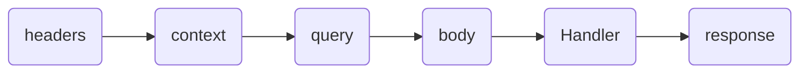

# next-rocket-kit 🚀

This package is intended to make it easy to build back-end applications in the framework, **next.js** with, using the **app** directory.

## Index

  [Configuration object 🔩🔧](#1-configuration-object-)
  [Tools we offer :hammer_and_wrench:](#2-tools-we-offer-)

# 1. Configuration object 🔩🔧

This object is used to define types and versions of the tools.

- Default object.
In the event that the user does not place a configuration object, this will be the object that will be used by default in the kit.

```typescript
import  { ConfigObject }  from  "next-rocket-kit";

const configObjet: ConfigObject = {
  resolver: "zod",
  oas: "3.1"
}
  ```

- Configuration object fields.

  - resolver: default value "zod" | "yup"
  Packet to validate data in the Route.

  - oas: default value "3.1"
  OpenAPI version.

# 2. Tools we offer 🔧🔨

> **Note 🧪:**      It is important to note that we will all be adding new tools to the kit in the future.

## Route 🔃

This tool helps to quickly create an endpoint using the **next.js** **API** folder.

```typescript
// "path file" ~ ./libs/rocketKit

"use server";

import  { createRocket }  from  "next-rocket-kit";
export  const  { Route }  =  createRocket();
 ```

```typescript
// "path file" ~ ./src/app/api/route.ts
import { Route } from '@/libs/rocketKit';

// End Point GET basic
export  const  GET  =  Route({
 Handler(req,  reply,  context)  {
  return  reply.json({  message:  "Hello World!"  },  {  status:  201  });
 },
});
 ```

### Configuration object for Route

- **Handler:** is the function that is executed when calling the end point. With the rocket **Route** it is much easier for us to create endpoints, such as a GET method endpoint.
The handler function receives three parameters to handle and control the request video cycle, these parameters are as follows.

  - req: Everything that arrives from the client and gives access to all the native methods of **NextRequest**.

   Rocket functions in req.

  - req.getBody(): return body.

  - req.getQuery(): return queries.

  - req.getContext(): return context include path params.

  - req.getHeaders(): return headers.

  - reply: used to reply to the client and gives access to all the native methods of **NextResponse**.

  - context (The native context of **nextjs**)

- **Schema (Schema valid):**
The schemas attribute allows you to validate the type and format of the data that enters and leaves the **Route**, to handle these validations **Route** is compatible with two possible third party libraries, **"zod"** and **"yup"**. By default, ```createRocketKit()``` uses **"zod"** as the validation library.

 ``` typescript
// "path file" ~ ./src/app/api/route.ts
 import { Route } from '@/libs/rocketKit';

 // End Point GET basic
 export  const  POST =  Route({
  schemas: {
   body: Schema,
   query: Schema,
   context: Schema,
   headers: Schema,
   response: Schema,
  },
  Handler(req,  reply,  context)  {
   return  reply.json({  message:  "Hello World!"  },  {  status:  201  });
  },
 });
 ```

The Schemas attribute uses a life cycle to execute the validations, the order of that life cycle is as follows.



## Module Http 📝

The Http tool will help you manage http status, to better manage and organize your request responses.
> **Note 📦:** rocket-kit uses the [http-status-codes](https://www.npmjs.com/package/http-status-codes) package

``` typescript
  const Http = {
    ReasonPhrases,
    StatusCodes,
    getReasonPhrase,
    getStatusCode,
  };
 ```

```typescript
// "path file" ~ ./libs/rocketKit
"use server";

import  { createRocket }  from  "next-rocket-kit";
export  const  { Route, Http }  =  createRocket();
  ```

``` typescript
// "path file" ~ ./src/app/api/route.ts
import { Route, Http } from '@/libs/rocketKit';
// End Point GET basic
export  const  GET  =  Route({
 Handler(req,  reply,  context)  {
  return  reply.json({
   message:  Http.ReasonPhrases.OK, // "OK"
  },
  {
   status:  Http.StatusCodes.OK, // 200
  });
 },
});
  ```

## Module OpenAPI 📝

   OpenAPI allows you to create a json in openapi "3.0" or "3.1" format, compatible with tools like **swagger**, **postman** and anyone that receives the openapi format.
> **Note 📦:** rocket-kit uses the [openapi3-ts](https://www.npmjs.com/package/openapi3-ts) package.

To define the openapi version you must use the **oas** attribute in the kit configuration object.

```typescript
// "path file" ~ ./libs/rocketKit
"use server";

import  { createRocket }  from  "next-rocket-kit";
export  const  { Route, Http, OpenApi }  =  createRocket();
  ```
