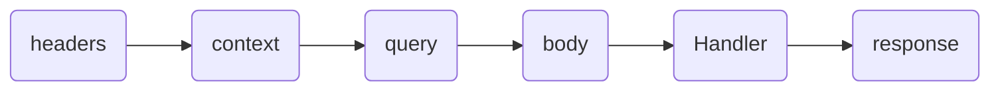

# next-rocket-kit 🚀

This package is intended to make it easy to build back-end applications in the framework, **next.js** with, using the **app** directory.

# Tools we offer 🛠️

> **Note 🧪:**      It is important to note that we will all be adding new tools to the kit in the future.

## Route 🔃

This tool helps to quickly create an endpoint using the **next.js** **API** folder.

```typescript
./libs/rocketKit
import  { createRocket }  from  "next-rocket-kit";
export  const  { Route }  =  createRocket();
 ```

``` typescript
./src/app/api/route.ts
import { Route } from '@/libs/rocketKit';
// End Point GET basic
export  const  GET  =  Route({
 Handler(req,  reply,  context)  {
  return  reply.json({  message:  "Hello World!"  },  {  status:  201  });
 },
});
```

### Configuration object for Route

- **Handler:** is the function that is executed when calling the end point. With the rocket **Route** it is much easier for us to create endpoints, such as a GET method endpoint.
The handler function receives three parameters to handle and control the request video cycle, these parameters are as follows.

  - req: Everything that arrives from the client and gives access to all the native methods of **NextRequest**.

   Rocket functions in req.

  - req.getBody(): return body.

  - req.getQuery(): return queries.

  - req.getContext(): return context include path params.

  - req.getHeaders(): return headers.

  - reply: used to reply to the client and gives access to all the native methods of **NextResponse**.

  - context (The native context of **nextjs**)

- **Schema (Schema valid):**
The schemas attribute allows you to validate the type and format of the data that enters and leaves the **Route**, to handle these validations **Route** is compatible with two possible third party libraries, **"zod"** and **"yup"**. By default, ```createRocketKit()``` uses **"zod"** as the validation library.

 ``` typescript
 import { Route } from '@/libs/rocketKit';
 // End Point GET basic
 export  const  POST =  Route({
  schemas: {
   body: Schema,
   query: Schema,
   context: Schema,
   headers: Schema,
   response: Schema,
  },
  Handler(req,  reply,  context)  {
   return  reply.json({  message:  "Hello World!"  },  {  status:  201  });
  },
 });
 ```

The Schemas attribute uses a life cycle to execute the validations, the order of that life cycle is as follows.



## Http Status 📝

Http provides the following functions and glossary.
> **Note 📦:** rocket-kit uses the [http-status-codes](https://www.npmjs.com/package/http-status-codes) package

```typescript
const Http = {
 ReasonPhrases,
 StatusCodes,
 getReasonPhrase,
 getStatusCode,
}
```

Use.

```typescript
./libs/rocketKit
import  { createRocket }  from  "next-rocket-kit";
export  const  { Route, Http }  =  createRocket();
 ```

``` typescript
./src/app/api/route.ts
import { Route, Http } from '@/libs/rocketKit';
// End Point GET basic
export  const  GET  =  Route({
 Handler(req,  reply,  context)  {
  return  reply.json({
   message:  Http.ReasonPhrases.OK, // "OK"
  },
  {
   status:  Http.StatusCodes.OK, // 200
  });
 },
});
```
