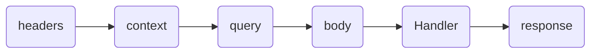

# next-rocket-kit 🚀

> **Note 🧪:** I will start the migration for next.js versions 15 and higher.

<div align="center">
  <a href="https://www.npmjs.com/package/@rocket-kit/next" target="_blank">
    
  </a>
</div>

<div align="center">
  <a href="https://www.npmjs.com/package/@rocket-kit/next" target="_blank">
    
  </a>
</div>

> **🚨 URGENT:** This package is being migrated to [@rocket-kit/next](https://www.npmjs.com/package/@rocket-kit/next). **Migrate now** for better performance and continued support!

I finally have version 2. It has the following important items:

1. It was migrated to the (@rocket-kit/next)[https://www.npmjs.com/package/@rocket-kit/next] package.
2. The API is not identical; some names were changed, such as getContext().params -> getPatams or getQuery -> getQueryParams.
3. The new version was split into two packages: resolver and rocket.
4. The Persian Zod resolver is less than 13 KB, and rocket is less than 25 KB.

This is important; it went from 244 KB to less than 25 KB.

5. The http-code and openApi features were temporarily removed. The plan is to integrate them into version 2.5, which I plan to release soon. This addition is subject to your feedback. A survey will be created in the repository so you can give your opinion on whether these features are missing.

# Index

- [Configuration object 🔩🔧.](#configuration-object-)
- [Tools we offer 🔧🔨.](#tools-we-offer-)
- [Route Module 🔃.](#route-module-)
    - [Configuration object for Route.](#configuration-object-for-route)
- [Prisma client creator 🔃.](#prisma-client-creator-)
- [Http Module 📝.](#http-module-)
- [OpenAPI Module 📝.](#openapi-module-)
    - [OpenApi Example.](#openapi-example)
    - [Recommendations for use with third-party packages to OpeanApi.](#recommendations-for-use-with-third-party-packages-to-opeanapi)

# Configuration object 🔩🔧

This object is used to define types and versions of the tools.

- Default object.
  In the event that the user does not place a configuration object, this will be the object that will be used by default in the kit.

    ````typescript
    import  { ConfigObject }  from  "next-rocket-kit";

    const configObjet: ConfigObject = {
      resolver: "zod",
      oas: "3.1"
    };
      ```
    ````

# Tools we offer 🔧🔨

> **Note 🧪:** It is important to note that we will all be adding new tools to the kit in the future.

## Route Module 🔃

This tool helps to quickly create an endpoint using the **next.js** **API** folder.

- We create the rocket to be able to access the tools in the kit.

    "path file" ~ ./libs/rocketKit/tools

```typescript
import { createRocket } from 'next-rocket-kit';

export const { onRoute, http, OpenApi } = createRocket();
```

- We define the router which should be used on the server side only, for this next.js gives us the comment function `use serve`.

    ```typescript
    // "path file" ~ ./libs/rocketKit/Route

    'use serve';

    import { onRoute } from './tools';

    export const { Route } = onRoute();
    ```

- We define barrel file.

    ```typescript
    // "path file" ~ ./libs/rocketKit/index

    export * from './tools';
    export * from './Route';
    ```

- We define a basic endPoint.

    ```typescript
    // "path file" ~ ./src/app/api/Route.ts

    import { Route } from '@/libs/rocketKit';

    // End Point GET basic
    export const GET = Route({
        Handler(req, reply, context) {
            return reply.json({ message: 'Hello World!' }, { status: 201 });
        },
    });
    ```

## Configuration object for Route

- **Handler:** is the function that is executed when calling the end point. With the rocket **Route** it is much easier for us to create endpoints, such as a GET method endpoint.
  The handler function receives three parameters to handle and control the request video cycle, these parameters are as follows.
    - req: Everything that arrives from the client and gives access to all the native methods of **NextRequest**.

    Rocket functions in req.
    - req.getBody(): return body.

    - req.getQuery(): return queries.

    - req.getContext(): return context include path params.

    - req.getHeaders(): return headers.

    - reply: used to reply to the client and gives access to all the native methods of **NextResponse**.

    - context (The native context of **nextjs**)

- **Schema (Schema valid):**
  The schemas attribute allows you to validate the type and format of the data that enters and leaves the **Route**, to handle these validations **Route** is compatible with two possible third party libraries, **"zod"** and **"yup"**. By default, `createRocketKit()` uses **"zod"** as the validation library.

    ```typescript
    // "path file" ~ ./src/app/api/route.ts
    import { Route } from '@/libs/Route';

    // End Point GET basic
    export const POST = Route({
        schemas: {
            body: Schema,
            query: Schema,
            context: Schema,
            headers: Schema,
            response: Schema,
        },
        Handler(req, reply, context) {
            return reply.json({ message: 'Hello World!' }, { status: 201 });
        },
    });
    ```

The Schemas attribute uses a life cycle to execute the validations, the order of that life cycle is as follows.



## Prisma client creator 🔃

This tool helps to quickly create an PrismaClient.

"path file" ~ ./libs/rocketKit/tools

```typescript
import { createRocket } from 'next-rocket-kit';

export const { onPrisma } = createRocket();
```

```typescript
import { PrismaClient } from '@prisma/client';
import { onPrisma } from './rocket';

export const { prisma } = onPrisma(PrismaClient);
```

Global where in the select.

```typescript
import { PrismaClient } from '@prisma/client';
import { onPrisma } from './rocket';

export const { prisma } = onPrisma(PrismaClient, {
    where: { delete_at: null },
});
```

## Http Module 📝

The Http tool will help you manage http status, to better manage and organize your request responses.

> **Note 📦:** rocket-kit uses the [http-status-codes](https://www.npmjs.com/package/http-status-codes) package

```typescript
const Http = {
    ReasonPhrases,
    StatusCodes,
    getReasonPhrase,
    getStatusCode,
};
```

```typescript
// "path file" ~ ./libs/rocketKit
import { createRocket } from 'next-rocket-kit';

export const { Http } = createRocket();
```

```typescript
// "path file" ~ ./src/app/api/route.ts
import { Http } from '@/libs/rocketKit';
import { Route } from '@/libs/Route';

// End Point GET basic
export const GET = Route({
    Handler(req, reply, context) {
        return reply.json(
            {
                message: Http.ReasonPhrases.OK, // "OK"
            },
            {
                status: Http.StatusCodes.OK, // 200
            },
        );
    },
});
```

## OpenAPI Module 📝

OpenAPI allows you to create a json in openapi ["3.0"](https://github.com/OAI/OpenAPI-Specification/blob/main/versions/3.0.3.md) or ["3.1"](https://github.com/OAI/OpenAPI-Specification/blob/main/versions/3.1.0.md) format, compatible with tools like **swagger**, **postman** and anyone that receives the openapi format.

> **Note 📦:** rocket-kit uses the [openapi3-ts](https://www.npmjs.com/package/openapi3-ts) package.

To define the openapi version you must use the **oas** attribute in the kit configuration object.

```typescript
// "path file" ~ ./libs/rocketKit
import { createRocket } from 'next-rocket-kit';

export const { Http, OpenApi } = createRocket();
```

### OpenApi Example

```typescript
// "path file" ~ ./libs/rocketKit
import { createRocket } from 'next-rocket-kit';

export const { Http, OpenApi } = createRocket();
```

```typescript
import { OpenApi } from './libs/rocketkt';

// declare info and openapi version.
const openApi = OpenApi({
    openapi: '3.0.3', // or 3.1.0
    info: {
        title: 'example',
        description: 'string',
        termsOfService: 'string',
        contact: {
            name: 'Author',
        },
        license: {
            name: 'MIT',
        },
        version: '1.0.0',
    },
});

openApi.addSchema('User', {
    type: 'object',
    properties: {
        id: {
            type: 'string',
        },
        name: {
            type: 'string',
        },
    },
});

openApi.addPath('/items', {
    description: 'return item list',
    post: {
        description: 'get items',
        summary: 'get items',
        requestBody: {
            description: 'body',
            content: {
                'application/json': {
                    schema: { $ref: '#/components/schemas/User' },
                },
            },
        },
        responses: {
            200: {
                description: 'ok',
                content: {
                    'application/json': {
                        schema: {
                            type: 'object',
                            properties: {
                                id: {
                                    type: 'string',
                                },
                            },
                        },
                    },
                },
            },
        },
    },
});

// return json string
openApi.getSpecAsJson();
// or return yml stirng
openApi.getSpecAsYaml();
```

### Recommendations for use with third-party packages to OpeanApi

How use OpenApi with "zod".

- [@anatine/zod-openapi](https://www.npmjs.com/package/@anatine/zod-openapi): With this package we can reuse the "zod" validation schemas that you should already be using in the Route schema field to validate the body or some other field of the request.

```typescript
import { OpenApi } from '@/libs/rocketKit';
import { generateSchema, extendZodWithOpenApi } from '@anatine/zod-openapi';
import { z } from 'zod';

// extend zod
extendZodWithOpenApi(z);

// declare info and openapi version.
const openApi = OpenApi({
    openapi: '3.0.3', // or 3.1.0
    info: {
        title: 'example',
        description: 'string',
        termsOfService: 'string',
        version: '1.0.0',
        contact: {
            name: 'Author',
        },
        license: {
            name: 'MIT',
        },
    },
});

const ItemZodSchema = z
    .object({
        id: z.string().uuid().nonempty().openapi({
            title: 'Item ID',
            description: 'A UUID generated by the server',
        }),
        name: z.string().min(2),
    })
    .openapi({
        title: 'Item',
        description: 'A item schema',
    });

const ItemOpenAPiSchema = generateSchema(ItemZodSchema);

openApi.addSchema('Item', ItemOpenAPiSchema);
```

> **Note 🧪:** In the case of **Yup** we have not found a package that meets the standards we are looking for, we remain attentive to options proposed by the community.
