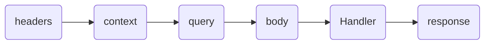

# Route Module 🔃

This tool helps to quickly create an endpoint using the **next.js** **API** folder.

```javascript
// "path file" ~ ./utils/rocketKit

import { createRocket } from "next-rocket-kit";

export const { onRoute } = createRocket();
```

```typescript
// "path file" ~ ./utils/Route
"use server";

import { onRoute } from "./rocketKit";

export const { Route } = onRoute();
```

```typescript
// "path file" ~ ./src/app/api/route.ts
import { Route } from "@/utils/Route";

// End Point GET basic
export const GET = Route({
  Handler(req, reply, context) {
    return reply.json({ message: "Hello World!" }, { status: 201 });
  },
});
```

## Configuration object for Route

- **Handler:** is the function that is executed when calling the end point. With the rocket **Route** it is much easier for us to create endpoints, such as a GET method endpoint.
  The handler function receives three parameters to handle and control the request video cycle, these parameters are as follows.

  - req: Everything that arrives from the client and gives access to all the native methods of **NextRequest**.

  Rocket functions in req.

  - req.getBody(): return body.

  - req.getQuery(): return queries.

  - req.getContext(): return context include path params.

  - req.getHeaders(): return headers.

  - reply: used to reply to the client and gives access to all the native methods of **NextResponse**.

  - context (The native context of **nextjs**)

- **Schema (Schema valid):**
  The schemas attribute allows you to validate the type and format of the data that enters and leaves the **Route**, to handle these validations **Route** is compatible with two possible third party libraries, **"zod"** and **"yup"**. By default, `createRocketKit()` uses **"zod"** as the validation library.

  ```typescript
  // "path file" ~ ./src/app/api/route.ts
  import { Route } from "@/utils/Route";

  // End Point GET basic
  export const POST = Route({
    schemas: {
      body: Schema,
      query: Schema,
      context: Schema,
      headers: Schema,
      response: Schema,
    },
    Handler(req, reply, context) {
      return reply.json({ message: "Hello World!" }, { status: 201 });
    },
  });
  ```

The Schemas attribute uses a life cycle to execute the validations, the order of that life cycle is as follows.




